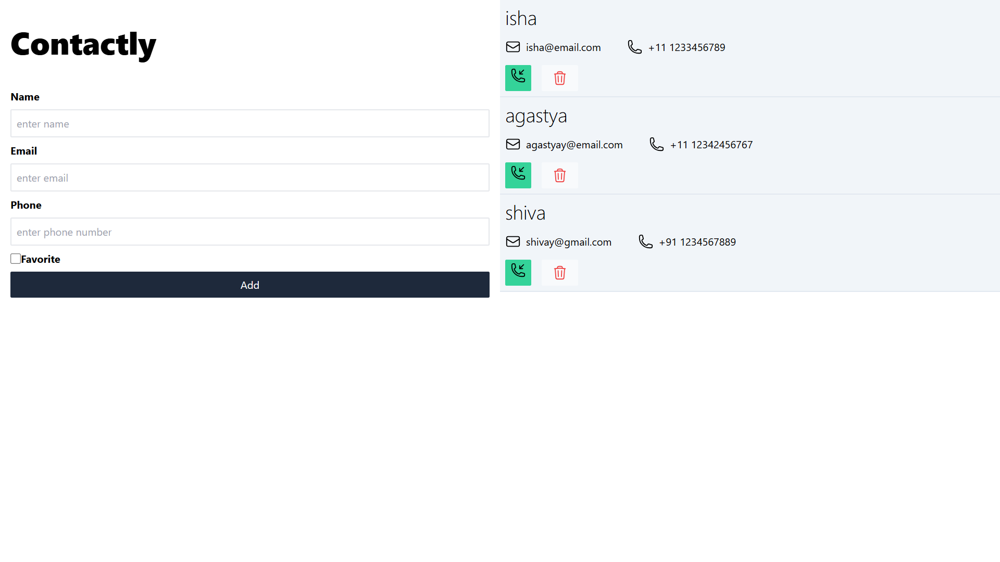
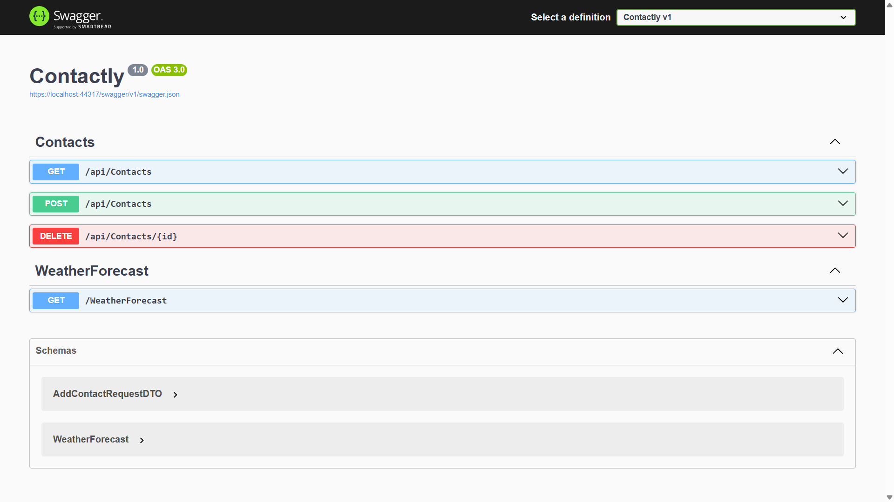

# Contactly

Full-stack contact management application built with Angular 17, ASP.NET Core Web API, Entity Framework Core, and SQL Server.

---

## Features

- Add new contacts
- View all contacts
- Delete contacts
- Reactive form handling
- REST API integration
- Responsive modern UI
- Full-stack CRUD architecture

---

## Tech Stack

### Frontend
- Angular 17
- TypeScript
- Tailwind CSS
- RxJS
- Reactive Forms

### Backend
- ASP.NET Core Web API
- Entity Framework Core
- SQL Server
- REST APIs

---

## Project Structure

```text
Contactly
├── 
│   └── contactly
│
├── UI
│   └── contactly.web
│
└── screenshots
```

---

## Screenshots

### Home Page



---


---


## Run Frontend

```bash
cd UI/contactly.web
npm install
npx ng serve
```

Frontend runs on:

```text
http://localhost:4200
```

---

## Run Backend

Open the API project in Visual Studio and run the ASP.NET Core Web API.

Backend runs on:

```text
https://localhost:44317
```

---

## API Endpoints

| Method | Endpoint | Description |
|---|---|---|
| GET | `/api/Contacts` | Get all contacts |
| POST | `/api/Contacts` | Add new contact |
| DELETE | `/api/Contacts/{id}` | Delete contact |

---

## Future Improvements

- Edit/Update contact
- Authentication & Authorization
- Search and filtering
- Pagination
- Cloud deployment


---

## Learning Outcomes

This project helped me practice:

- Full-stack application development
- Angular standalone components
- Reactive forms
- ASP.NET Core Web API development
- Entity Framework Core
- REST API integration
- Git & GitHub workflows

---

## Author

Sesadri Nayak